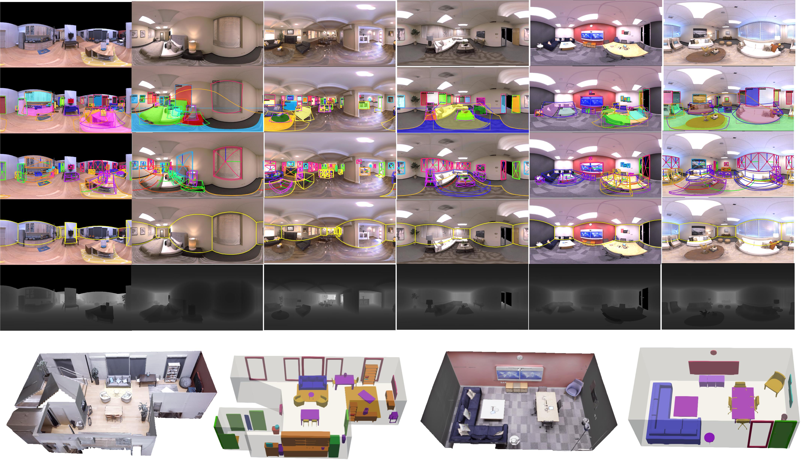
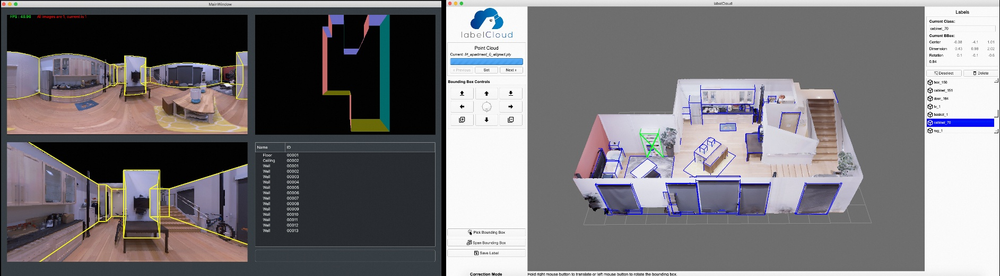
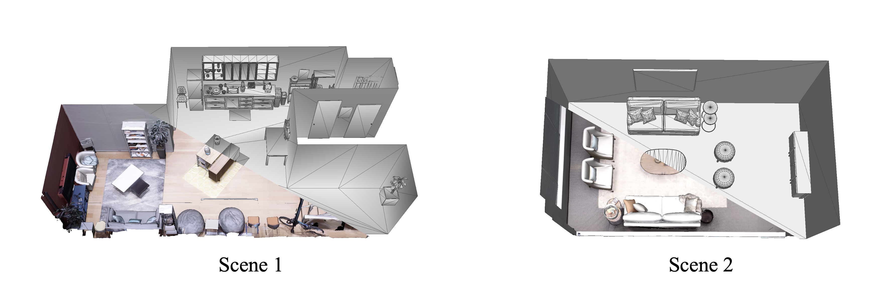

# ReplicaPano-Dataset
This repo contains visualization code of our ReplicaPano Dataset.

### PanoContext-Former: Panoramic Total Scene Understanding with a Transformer
Yuan Dong*, Chuan Fang*, Liefeng Bo, Zilong Dong, Ping Tan†

[[Project Page]](https://fangchuan.github.io/PanoContext-Former/)[[Paper]](https://openaccess.thecvf.com/content/CVPR2024/papers/Dong_PanoContext-Former_Panoramic_Total_Scene_Understanding_with_a_Transformer_CVPR_2024_paper.pdf)[[Video]](https://www.youtube.com/watch?v=p6tp1C1JEtg&t=96s)

### Panoramic 3D Scene Understanding Dataset




## Install

Install necessary tools and create conda environment (needs to install anaconda if not available): 
```
conda create -n replicapano python=3.8
conda activate replicapano
conda install pytorch==1.11.0 torchvision==0.12.0 torchaudio==0.11.0 cudatoolkit=11.3 -c pytorch
pip install -r requirements.txt
python -m pip install 'git+https://github.com/facebookresearch/detectron2.git'
```


## Dataset description
ReplicaPano is a new panoramic dataset that offers various ground truths, including photo-realistic panorama, depth maps, real-world 3D room layouts and 3D oriented object bounding boxes, and object meshes.
The RGB panoramic images and depth maps are all rendered from [real-scan](https://github.com/facebookresearch/Replica-Dataset). 
We hired three data annotators and spent over 700 hours annotating the room layout and oriented object bounding boxes through [PanoAnnotator](https://github.com/SunDaDenny/PanoAnnotator) and [labelCloud](https://github.com/ch-sa/labelCloud), respectively. 




Please note that to enhance the quality of the ReplicaPano dataset, open-source object meshes were created by professional modelers who generated CAD models based on the original surface meshes of the objects, as shown in the figure below：



## Dataset visualization

```shell
python main.py --pkl_path example/data.pkl
```

## Dataset download

You can download ReplicaPano dataset through [Google Drive](https://drive.google.com/drive/folders/1fWNMJyWSacGsB_9HKndm9lOM6wSLshxR?usp=sharing), with each scene containing the following information:

```
<sceneID>
├── Scene_Info
│       └── <panoramaID>
│           ├── data.pkl
│           ├── depth.png
│           └── rgb.png
├── Object_Mesh
│       └── <object_name>.obj
├── <sceneID>_aligned.ply
```
Note that: In the <Object_Mesh>, we provide some objects that are not labeled in <data.pkl>,
and a few objects in <data.pkl> could not be modeled due to the modeler's inability to create a better representation.


## Citation

If you find our work helpful, please consider cite:
```
@inproceedings{dong2024panocontext,
  title={PanoContext-Former: Panoramic total scene understanding with a transformer},
  author={Dong, Yuan and Fang, Chuan and Bo, Liefeng and Dong, Zilong and Tan, Ping},
  booktitle={Proceedings of the IEEE/CVF Conference on Computer Vision and Pattern Recognition},
  pages={28087--28097},
  year={2024}
}
```

We thank the following great works:
- [DeepPanoContext](https://github.com/chengzhag/DeepPanoContext) We construct the visualization code based on their well-structured code.
- [Replica-Dataset](https://github.com/facebookresearch/Replica-Dataset) for their dataset. 

If you find them helpful, please cite:
```
@inproceedings{zhang2021deeppanocontext,
  title={DeepPanoContext: Panoramic 3D Scene Understanding With Holistic Scene Context Graph and Relation-Based Optimization},
  author={Zhang, Cheng and Cui, Zhaopeng and Chen, Cai and Liu, Shuaicheng and Zeng, Bing and Bao, Hujun and Zhang, Yinda},
  booktitle={Proceedings of the IEEE/CVF International Conference on Computer Vision},
  pages={12632--12641},
  year={2021}
}

@article{straub2019replica,
  title={The Replica dataset: A digital replica of indoor spaces},
  author={Straub, Julian and Whelan, Thomas and Ma, Lingni and Chen, Yufan and Wijmans, Erik and Green, Simon and Engel, Jakob J and Mur-Artal, Raul and Ren, Carl and Verma, Shobhit and others},
  journal={arXiv preprint arXiv:1906.05797},
  year={2019}
}
```

